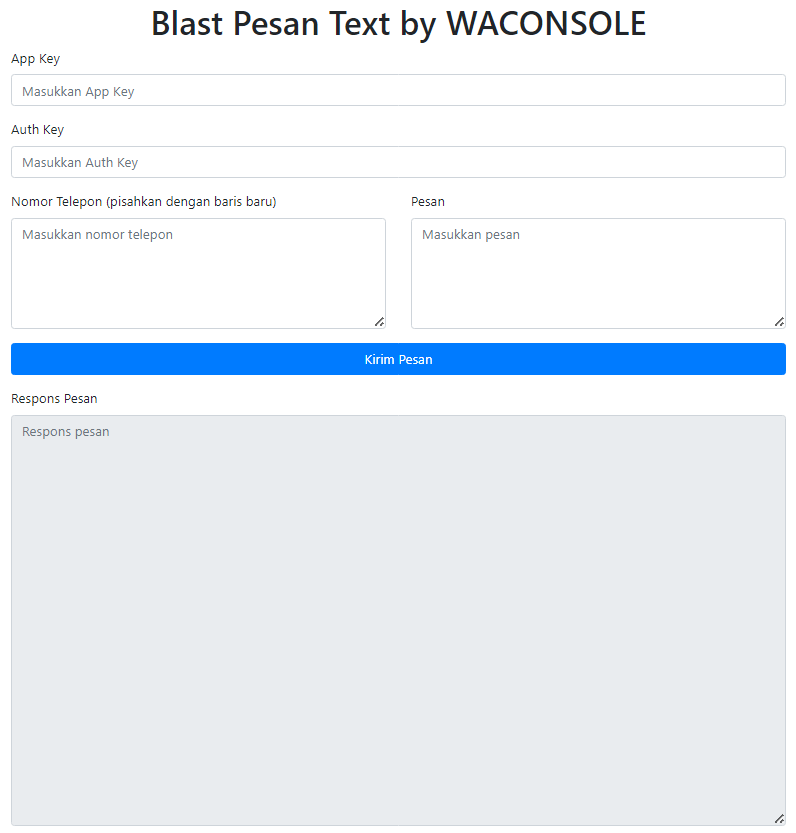

Untuk menggunakan Whatsapp Blast Text menggunakan repository yang diberikan, ikuti langkah-langkah berikut:

1. Unduh file `index.html` dari repository di https://github.com/Cloud-Dark/blast_text_message_waconsole. Caranya, buka link tersebut dan klik tombol "Code" berwarna hijau, kemudian pilih opsi "Download ZIP". Ekstrak file ZIP setelah selesai mengunduh.

2. Setelah mengunduh dan mengekstrak file `index.html`, buka file tersebut dengan browser yang Anda gunakan (misalnya, Google Chrome, Mozilla Firefox).

3. Pastikan Anda tidak perlu menginstal Apache, MySQL, XAMPP, atau LAMPP, karena aplikasi ini dapat berjalan langsung di browser.

4. Dapatkan `appkey` dan `authkey` dari waconsole.apipedia.id. Anda perlu memasukkannya ke dalam aplikasi untuk mengautentikasi penggunaan layanan ini. Pastikan untuk mengikuti petunjuk pada waconsole.apipedia.id untuk mendapatkan kunci-kunci ini.

5. Isi nomor telepon yang akan Anda jadikan target dalam kotak teks. Pisahkan setiap nomor telepon dengan baris baru. Contoh:
   ```
   628998937095
   628998937096
   628998937097
   ```

6. Masukkan teks pesan yang ingin Anda kirim ke nomor-nomor telepon tersebut. Anda dapat menggunakan variabel dari waconsole.apipedia.id jika diperlukan.

7. Klik tombol "Kirim Pesan" atau "Send Message" untuk mengirim pesan. Anda akan melihat tanggapan dari layanan dalam kotak teks "Response".

Pastikan Anda telah mengikuti instruksi dengan benar dan memasukkan informasi yang diperlukan dengan tepat untuk menggunakan Whatsapp Blast Text melalui aplikasi ini.
